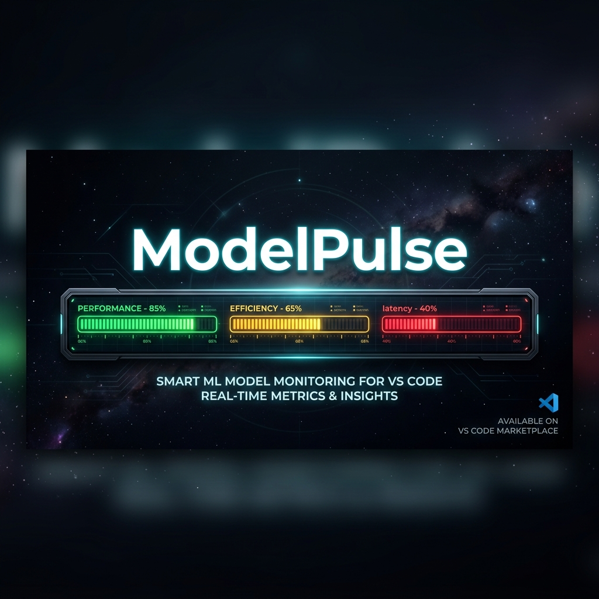

<div align="center">
  
  
  <h1>ModelPulse</h1>
  <p><b>At-a-glance AI model quota monitoring in your VS Code status bar with rich hover tooltips.</b></p>

  <p>
    <a href="https://marketplace.visualstudio.com/items?itemName=antigravity.modelpulse"></a>
    <a href="https://marketplace.visualstudio.com/items?itemName=antigravity.modelpulse"></a>
    <a href="https://github.com/antigravity/modelpulse/blob/main/LICENSE"></a>
  </p>
</div>

<br>

ModelPulse is a sleek, minimal, and highly customizable VS Code extension designed for power AI users. Keep track of your Antigravity AI model quotas right inside your status bar without breaking your flow. 

## ✨ Features

### 📊 Status Bar Display
Stay informed with real-time model quotas pinned to your status bar. Choose from three dynamic display modes:
- **Standard**: `🟢 Sonnet: 78% 🟡 Gem Pro↑: 8% 🟠 o3: 28%`
- **Compact**: `🟢78% 🟡8% 🟠28%`
- **Minimal**: `🟢🟡🔴` (Clean & unobtrusive dots only)

### 🎯 Rich Hover Tooltip
Just hover over the status bar item to reveal a rich popup:
- **Organized by Family**: Claude, Gemini, GPT models cleanly categorized.
- **Visual Progress**: Custom progress bars for an instant understanding of your usage.
- **Precision Metrics**: See exact percentage remaining, credits, and the reset countdown.

### 📌 Persistent QuickPick Panel
Click the status indicator to open an interactive command panel:
- **Comprehensive View**: Inspect detailed quota info for all supported models.
- **Model Capabilities**: Instantly check capabilities like Text, Code, Image, Video, and Thinking logic.
- **Quick Toggles**: Pin or unpin specific models to your status bar on the fly.
- **Lightning Fast**: Press `Esc` to dismiss and get back to coding.

## 🚀 Supported Models (Mock Data)

| Family | Models |
|--------|--------|
| **🟣 Claude** | Claude 4.5 Sonnet, Claude 4.5 Sonnet (Thinking), Claude Opus 4 |
| **🔵 Gemini** | Gemini 2.5 Pro (High/Low), Gemini 2.5 Flash, Gemini Pro Image |
| **🟠 GPT** | GPT o3, GPT o4-mini |

*(More models added dynamically as Antigravity expands its ecosystem!)*

## ⚙️ Configuration

Tune ModelPulse to fit your exact workflow in VS Code Settings:

| Setting | Default | Description |
|---------|---------|-------------|
| `agStatusBar.refreshInterval` | `15` | How often to fetch quota data (in seconds). Range: 5-3600. |
| `agStatusBar.displayFormat` | `standard` | Choose your aesthetic: `standard`, `compact`, `minimal`. |
| `agStatusBar.warningThreshold` | `60` | Quota drops below this %? The indicator turns **yellow**. |
| `agStatusBar.criticalThreshold` | `40` | Quota drops below this %? The indicator turns **red**. |
| `agStatusBar.isPremiumUser` | `false` | Enable to unlock extended premium models on your tracker. |

## 🛠️ Commands

Access via the Command Palette (`Ctrl+Shift+P` / `Cmd+Shift+P`):

- `Antigravity: Show Model Quota Details` — Opens the interactive dashboard panel.
- `Antigravity: Refresh Quota Data` — Force-syncs your quota data immediately.

## 💻 Development

Want to contribute or run it locally?

```bash
# 1. Install dependencies
npm install

# 2. Build the extension
npm run compile

# 3. Watch mode (for live development)
npm run watch
```
*Press `F5` in VS Code to launch the Extension Host and test your changes.*

## 📄 License

[MIT](LICENSE) © Antigravity
